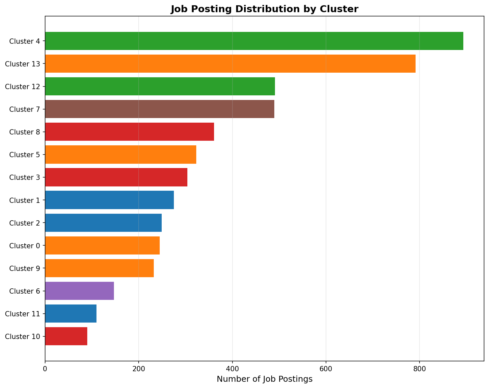
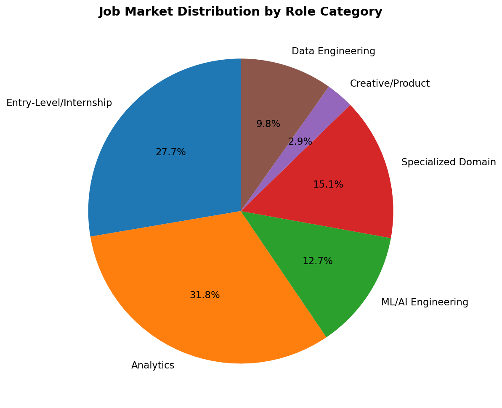
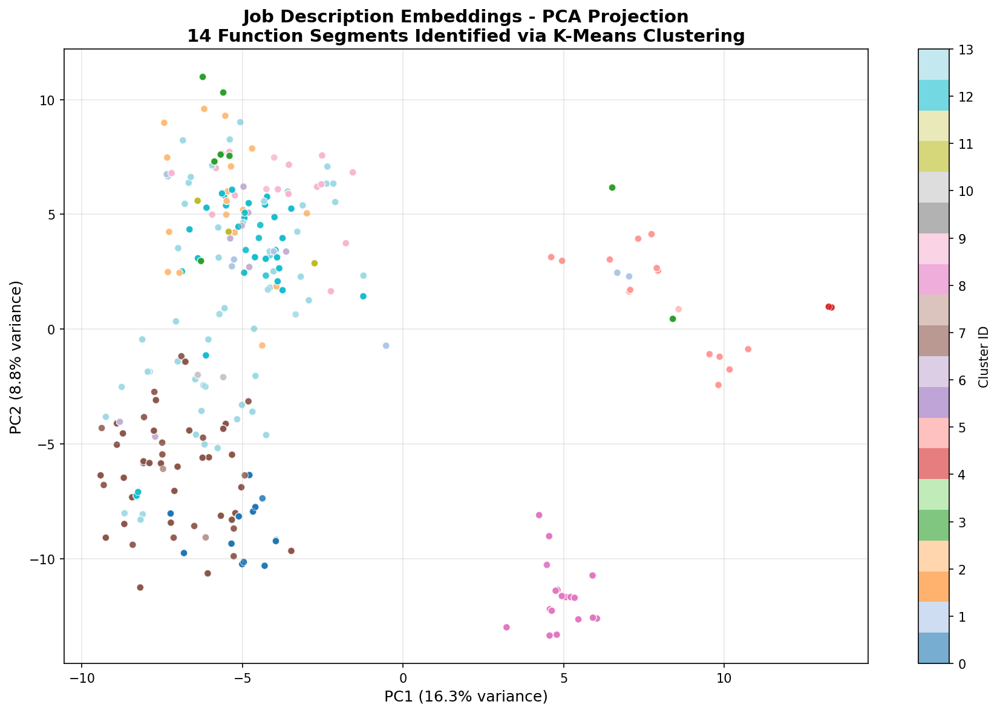

<p align="center">
  
  
  
  
  
  
</p>

<h1 align="center">Job Market Stream</h1>

<p align="center">
  <strong>A real-time data science job market analytics pipeline</strong><br>
  Scraping → Streaming → Analytics → Interactive Dashboard
</p>

<p align="center">
  <a href="https://junewayne.github.io/Job_Market_Stream/"><strong>View Live Dashboard</strong></a>
</p>

---

## Overview

**Job Market Stream** is a fully automated, end-to-end data pipeline that continuously tracks the **data science and analytics internship job market**. It treats job postings as a live data stream, enabling real-time insights into hiring trends, skill demands, and geographic distributions.

### What You Can Explore

| Metric                        | Description                                                    |
| ----------------------------- | -------------------------------------------------------------- |
| **Daily Trends**              | 180-day rolling view of job posting volume                     |
| **Job Functions**             | Distribution across Data Science, Analytics, Engineering roles |
| **Work Modes**                | Remote vs. Hybrid vs. On-site breakdown                        |
| **Geographic Map**            | Interactive clustered map of job locations                     |
| **Beeswarm Plot**             | Visual exploration by function, company, skills, time          |
| **Top Skills**                | Most in-demand technical skills extracted from descriptions    |
| **24-Hour Activity**          | Hourly posting patterns and real-time pulse                    |
| **Skills Network**            | Co-occurrence relationships between skills                     |
| **Job Function Segmentation** | 14 distinct job archetypes identified via NLP clustering       |

---

## NLP Analytics & Job Function Segmentation

### Advanced Job Market Analysis

Beyond real-time dashboards, this project includes **deep NLP analysis** to uncover hidden job market structures using transformer-based embeddings and unsupervised clustering.

**Analysis Notebook:** [`NLP_Analytics/data_science_microprofessions.ipynb`](NLP_Analytics/data_science_microprofessions.ipynb)

#### Key Findings: 14 Job Function Segments Identified

Analyzed **5,001 job postings** (Dec 2025 - Jan 2026) using K-Means clustering (k=14, silhouette score: 0.316) on sentence embeddings:

| Macro Category             | Clusters | % of Market | Key Roles                                                       |
| -------------------------- | -------- | ----------- | --------------------------------------------------------------- |
| **Analytics**              | 0,5,9,13 | 31.8%       | Business Data Analyst, Analytics Engineer, Influencer Marketing |
| **Entry-Level/Internship** | 4,12     | 27.7%       | Junior Data Analyst, Entry-Level ML Intern                      |
| **Specialized Domain**     | 3,8,10   | 15.1%       | Enterprise Data Science (IBM), BI Analyst, Sports Analytics     |
| **ML/AI Engineering**      | 1,2,11   | 12.7%       | AI/ML Model Dev, Product ML Engineer, ML Infrastructure         |
| **Data Engineering**       | 7        | 9.8%        | Data Pipeline Engineering, ETL Programs                         |
| **Creative/Product**       | 6        | 2.9%        | Creative/Media Data Analytics                                   |

#### Cluster Visualizations

**1. Cluster Size Distribution by Category**
<p align="center">
  
</p>

Horizontal bar chart showing job posting volume across 14 clusters, color-coded by macro category. Entry-level roles (Cluster 4: 893 jobs, Cluster 13: 791 jobs) dominate the market.

**2. Job Market Composition Pie Chart**
<p align="center">
  
</p>

Market breakdown reveals analytics and entry-level positions comprise nearly 60% of all postings, while specialized ML/AI roles represent a competitive 12.7%.

**3. PCA Embedding Visualization**
<p align="center">
  
</p>

2D projection of job description embeddings shows clear cluster separation, validating the 14-segment job function taxonomy. The PCA analysis explains 25% of total variance while preserving the semantic structure discovered through K-Means clustering.

#### Methodology Highlights

- **Text Processing**: all-MiniLM-L6-v2 sentence transformer for semantic embeddings
- **Clustering**: K-Means with hyperparameter tuning (silhouette score optimization)
- **Interpretation**: TF-IDF term extraction + manual semantic labeling
- **Skill Analysis**: Cross-cluster technology stack profiling (70+ skills tracked)
- **Temporal Tracking**: Quarterly cluster stability and evolution metrics

#### Strategic Insights

1. **Market Fragmentation**: Data science roles are stratifying into 14+ distinct archetypes requiring targeted specialization
2. **Entry-Level Saturation**: 27.7% of market is internship/junior roles, indicating strong talent pipeline demand
3. **Technology Divide**: Clear skill stack separation (SQL/Tableau for analytics vs PyTorch/Docker for ML engineering)
4. **Domain Specialization**: Industry-specific expertise (sports, media, enterprise) creates niche opportunities

---

## Architecture

### High-Level System Design

```
┌─────────────────────────────────────────────────────────────────────────────────────┐
│                        JOB MARKET STREAM PIPELINE (v2.0)                            │
│                      Real-time Streaming to PostgreSQL/Supabase                     │
└─────────────────────────────────────────────────────────────────────────────────────┘

  ┌──────────────┐     ┌──────────────┐     ┌──────────────┐     ┌──────────────┐
  │   LinkedIn   │     │    Kafka     │     │   Consumer   │     │   Staging    │
  │   Scraper    │───▶│   Producer   │────▶│  (Redpanda)  │───▶│     CSV      │
  │              │     │              │     │              │     │              │
  │ scraper.py   │     │ producer.py  │     │ consumer.py  │     │parsed_jobs.csv
  └──────────────┘     └──────────────┘     └──────────────┘     └──────┬───────┘
                                                                        │
                                                                        │
                                                                        ▼
                                                                 ┌──────────────┐
  ┌──────────────┐     ┌──────────────┐     ┌──────────────┐     │  Supabase    │
  │   GitHub     │     │   FastAPI    │     │  PostgreSQL  │◀───│  Ingestion    │
  │   Pages      │◀────│    Server    │◀───│   Database   │     │              │
  │              │     │              │     │              │     │supabase_*.py │
  │ index.html   │     │fast_api_*.py │     │  (Supabase)  │     └──────────────┘
  └──────────────┘     └──────────────┘     └──────────────┘      
        ▲                                           ▲              
        │                                           │             
        │                                           │
        └───────────────────────────────────────────┘
        dashboard powered by REST API Endpoints on Render
```

### Pipeline Flow Diagram

```mermaid
flowchart LR
    subgraph Scraping["Data Collection"]
        A[LinkedIn Public API] --> B[scraper.py]
    end
    
    subgraph Streaming["Message Streaming"]
        B --> C[producer.py\nHost Network Mode]
        C --> D[(Redpanda\nKafka Broker)]
        D --> E[consumer.py\nConsumer Group]
    end
    
    subgraph Processing["Data Processing"]
        E --> F[job_parser.py\nSkills & Degree Extraction]
        F --> G[Append to CSV]
        G --> H[(parsed_jobs.csv)]
    end
    
    subgraph Database["Cloud Database"]
        H --> I[supabase_ingestion.py\nFile Change Detection]
        I --> J[(PostgreSQL\nSupabase Cloud)]
        J --> K[Automated Upserts\nEvery 2 Minutes]
        K --> J
    end
    
    subgraph Analytics["Analytics API"]
        J --> L[fast_api_analytics.py\n26 Endpoints]
        L --> M[CORS Enabled\nRender Deployment]
    end
    
    subgraph Frontend["Dashboard"]
        M --> N[index.html\nD3.js + Leaflet]
        N --> O[GitHub Pages]
    end
    
    style Scraping fill:#e1f5fe
    style Streaming fill:#fff3e0
    style Processing fill:#f3e5f5
    style Database fill:#c8e6c9
    style Analytics fill:#e8f5e9
    style Frontend fill:#fce4ec
```



---

## Components Deep Dive

### Data Collection Layer

| Component            | File          | Description                                                                                                                                                    |
| -------------------- | ------------- | -------------------------------------------------------------------------------------------------------------------------------------------------------------- |
| **LinkedIn Scraper** | `scraper.py`  | Scrapes LinkedIn's public jobs API (`jobs-guest`) for data/analytics internships. Extracts job details, descriptions, application links, and applicant counts. |
| **Kafka Producer**   | `producer.py` | Serializes scraped jobs to JSON and publishes to the `job_postings` Kafka topic. Runs on a configurable interval (default: every 30 minutes).                  |

### Stream Processing Layer

| Component           | File                  | Description                                                                                                           |
| ------------------- | --------------------- | --------------------------------------------------------------------------------------------------------------------- |
| **Redpanda Broker** | `docker-compose.yaml` | Lightweight Kafka-compatible message broker. Handles pub/sub messaging between producer and consumer.                 |
| **Kafka Consumer**  | `consumer.py`         | Subscribes to `job_postings` topic, processes each message through the parsing pipeline, and persists to staging CSV. |

### Data Transformation Layer

| Component              | File                    | Description                                                                                                                                                                                                                                                                                    |
| ---------------------- | ----------------------- | ---------------------------------------------------------------------------------------------------------------------------------------------------------------------------------------------------------------------------------------------------------------------------------------------- |
| **Job Parser**         | `job_parser.py`         | **NLP-powered extraction engine** that identifies: <br>• 70+ technical skills (Python, SQL, TensorFlow, etc.)<br>• Job functions (Data Science, Analytics, Engineering)<br>• Degree requirements (PhD, Master's, Bachelor's)<br>• Work mode (Remote, Hybrid, On-site)<br>• Time posted parsing |
| **CSV Writer**         | `save_csv.py`           | Thread-safe append-only CSV writer with deduplication.                                                                                                                                                                                                                                         |
| **Supabase Ingestion** | `supabase_ingestion.py` | Syncs staging CSV to Supabase PostgreSQL cloud database. Monitors file changes via mtime (every 2 minutes), performs in-memory deduplication by `job_id`, and executes batch upserts with conflict resolution (`COALESCE` preserves non-null values).                                          |
| **Geo Encoder**        | `geo_encode.py`         | Geocodes job locations using OpenStreetMap Nominatim API. Creates `geo_locations` table with lat/lon coordinates for map visualization.                                                                                                                                                        |

### Analytics API Layer

| Component          | File                    | Description                                                                                                                                                                                                                   |
| ------------------ | ----------------------- | ----------------------------------------------------------------------------------------------------------------------------------------------------------------------------------------------------------------------------- |
| **FastAPI Server** | `fast_api_analytics.py` | RESTful API serving 26 analytics endpoints from Supabase PostgreSQL. Handles CORS, Decimal conversion, and error handling. Deployed via Render Cloud Webservices platform (Free version, hence API may spin down when unused) |

**API Endpoints:**

| Endpoint                    | Description                            |
| --------------------------- | -------------------------------------- |
| `GET /api/overview`         | Total jobs, unique companies/locations |
| `GET /api/jobs_by_function` | Job function distribution              |
| `GET /api/work_mode`        | Remote/Hybrid/On-site breakdown        |
| `GET /api/daily_counts`     | 180-day daily posting trend            |
| `GET /api/hourly_counts`    | 24-hour activity pattern               |
| `GET /api/top_skills`       | Most demanded skills                   |
| `GET /api/beeswarm_jobs`    | Individual jobs for beeswarm           |
| `GET /api/map_jobs`         | Geocoded jobs for map                  |
| `GET /api/skills_network`   | Skill co-occurrence graph              |
| `GET /api/pulse_metrics`    | Real-time stream health                |
| ... and 16 more endpoints   | See code for full list                 |

### Data Visualization & Insights

| Component     | File         | Description                                                                                                                        |
| ------------- | ------------ | ---------------------------------------------------------------------------------------------------------------------------------- |
| **Dashboard** | `index.html` | Single-page static site with D3.js visualizations, Leaflet maps with MarkerCluster, and responsive design. Hosted on GitHub Pages. |

**Visualizations:**
- **Line Chart**: 180-day daily job posting trends
- **Bar Charts**: Job function & work mode distributions
- **Beeswarm Plot**: Interactive job explorer (group by function, company, skills, time)
- **Cluster Map**: Geographic distribution with popup job cards
- **Force Graph**: Skills co-occurrence network
- **Bubble Chart**: 24-hour posting activity

---

## Docker Services

```yaml
services:
  redpanda        # Kafka-compatible message broker
  console         # Redpanda management UI (localhost:8080)
  producer        # LinkedIn scraper + Kafka producer
  consumer        # Kafka consumer + job parser
  duckdb_refresher # Periodic DuckDB ingestion
```

---

## Docker Services

All services are defined in `docker-compose.yaml`:

| Service             | Purpose          | Port | Notes                                                                    |
| ------------------- | ---------------- | ---- | ------------------------------------------------------------------------ |
| `redpanda`          | Kafka broker     | 9092 | Handles message streaming between producer/consumer                      |
| `redpanda-console`  | Redpanda UI      | 8080 | Monitor topics, messages, consumer groups                                |
| `producer`          | LinkedIn scraper | -    | Host network mode with `extra_hosts` for Kafka DNS resolution            |
| `consumer`          | Stream processor | -    | Consumes from `job_postings` topic, appends to CSV                       |
| `supabase_ingestor` | Database sync    | -    | Watches CSV file (mtime), upserts to Supabase PostgreSQL every 2 minutes |
| `duckdb_refresher`  | Legacy service   | -    | **Deprecated**: Old DuckDB pipeline (kept for compatibility)             |

**Environment Variables:**
- `KAFKA_SERVER`: Bootstrap servers for Kafka connection
- `SCRAPER_INTERVAL_HOURS`: Scraping frequency (default: 0.5)
- `SUPABASE_INGEST_INTERVAL_SECONDS`: Database sync frequency (default: 120)
- `SUPABASE_DB_*`: Connection credentials for Supabase PostgreSQL

---

## Project Structure

```
Job_Market_Stream/
├── Scraping
│   ├── scraper.py          # LinkedIn jobs scraper (macOS Chrome UA)
│   └── producer.py         # Kafka message producer (host network mode)
│
├── Streaming
│   ├── consumer.py         # Kafka message consumer
│   └── config.py           # Kafka configuration
│
├── Data Processing
│   ├── job_parser.py       # NLP skill/function extraction
│   ├── save_csv.py         # CSV persistence layer
│   ├── supabase_ingestion.py # Supabase PostgreSQL ETL pipeline
│   └── geo_encode.py       # Location geocoding
│
├── Data Analytics
│   └── fast_api_analytics.py  # REST API server (26 endpoints)
│
├── NLP Analytics
│   ├── data_science_microprofessions.ipynb  # Clustering analysis notebook
│   ├── cluster_interpretations.csv          # Cluster metadata & labels
│   └── clustered_jobs.csv                   # Jobs with cluster assignments
│
├── Frontend
│   ├── index.html          # Dashboard (D3.js + Leaflet)
│   └── static/             # Static assets
│
├── Data
│   ├── parsed_jobs.csv     # Staging CSV file
│   └── jobs.duckdb         # Legacy local database (deprecated)
│
├── Docker
│   ├── Dockerfile          # Container image definition
│   └── docker-compose.yaml # Orchestration config (6 services)
│
└── Config
    ├── requirements.txt    # Python dependencies
    └── config.py           # Environment variables
```

---

## Tech Stack

| Layer              | Technology                                  |
| ------------------ | ------------------------------------------- |
| **Scraping**       | Python, BeautifulSoup, Requests             |
| **Streaming**      | Apache Kafka (Redpanda), kafka-python       |
| **Storage**        | Supabase PostgreSQL, CSV (staging)          |
| **API**            | FastAPI, Uvicorn, psycopg2                  |
| **Visualization**  | D3.js, Leaflet, MarkerCluster, Matplotlib   |
| **NLP/ML**         | Sentence-Transformers, Scikit-learn, TF-IDF |
| **Geocoding**      | OpenStreetMap Nominatim                     |
| **Infrastructure** | Docker, Docker Compose                      |
| **Hosting**        | GitHub Pages (frontend), Render (API)       |

---

## Skills Extraction

The parser extracts **70+ technical skills** organized into categories:

| Category             | Examples                                   |
| -------------------- | ------------------------------------------ |
| **Languages**        | Python, R, SQL, Java, Scala, Go            |
| **ML/AI**            | TensorFlow, PyTorch, Scikit-learn, XGBoost |
| **Data Engineering** | Spark, Kafka, Airflow, dbt, Snowflake      |
| **Cloud**            | AWS, Azure, GCP, Lambda, S3                |
| **Visualization**    | Tableau, Power BI, Looker, D3.js           |
| **Databases**        | PostgreSQL, MongoDB, Redis, DuckDB         |
| **DevOps**           | Docker, Kubernetes, Git, CI/CD             |

---

## Live Demo

<p align="center">
  <a href="https://junewayne.github.io/Job_Market_Stream/">
    
  </a>
</p>

**Dashboard URL:** [https://junewayne.github.io/Job_Market_Stream/](https://junewayne.github.io/Job_Market_Stream/)

<p align="center">
  Made with love for data science job seekers
</p>
